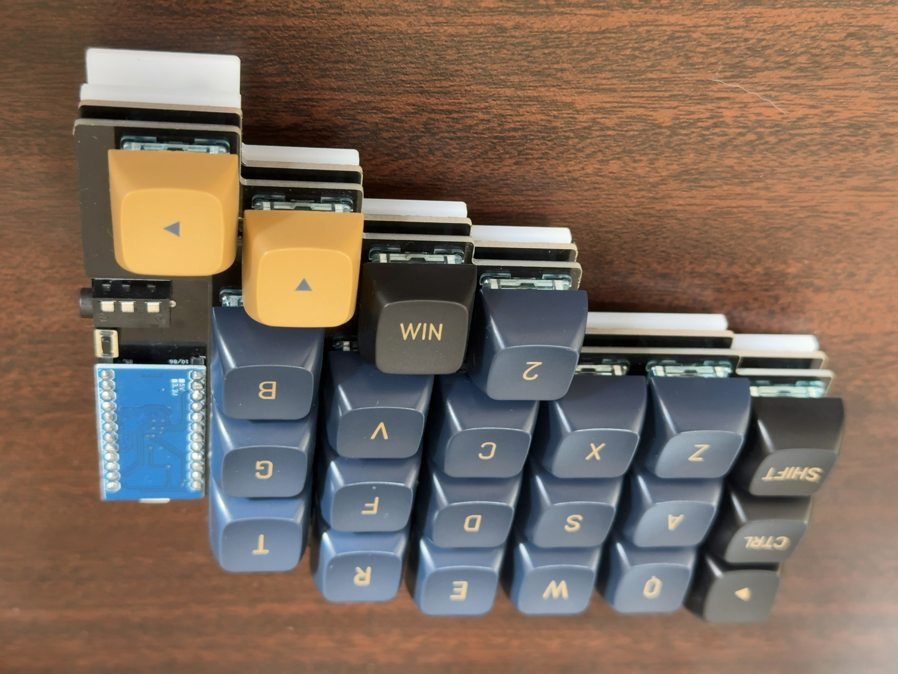

# maggie44

maggie44はTamarohが初めて作成した試作カスタムキーボードです。
- 左右対象、分割、40%、カラムスタッガード
- T、Yキーがホームポジションに近く押しやすい
- 自然にハの字に手が配置される
- 尺屈角度や頻度を減らし手首にやさしいデザイン

## キーマップ

詳細については[ソースコード](https://github.com/tamaroh/qmk_firmware/tree/tamaroh/keyboards/maggie44/keymaps/default)を確認してください

## 必要なもの
|品名|数量|備考|入手先|
|----|----|----|----|
|PCB|2枚|左右別々のデータです ver1.0は一部配線の修正が必要です|このRepositoryのデータから作成してください
|キープレート|2枚|裏返して左右どちらでも使えます|このRepositoryのデータから作成してください
|ボトムプレート大・小|各2枚|アクリル 2mm推奨|このRepositoryのデータから作成してください
|M2ネジ 4mm|20本|ボトムプレートの厚さによって長さは異なります|[遊舎工房](https://shop.yushakobo.jp/products/8006)など
|M2スペーサー 7mm|10個||[遊舎工房](https://shop.yushakobo.jp/products/a0800c2)など
|Pro Micro|2個|すべての互換品については動作を保障しません|[遊舎工房](https://shop.yushakobo.jp/products/pro-micro)など
|ピンヘッダー またはコンスルー|12Pin x 4個||[遊舎工房](https://shop.yushakobo.jp/products/31)など
|タクトスイッチ TS-1136-4.3|2個||[TALP KEYBOARD](https://talpkeyboard.net/items/5fa258a5f0b10814d183347f)など
|ダイオード 1N4148|44個|SMD/スルーホール両対応|[TALP KEYBOARD](https://talpkeyboard.net/items/6294480b0ebded1af895c437)など
|スイッチ用PCBソケット|44個|Cherry MX互換のみ対応|[TALP KEYBOARD](https://talpkeyboard.net/items/5e02c5405b120c792616bcf9)など
|TRRSジャック|2個|3.5mm 4極|[TALP KEYBOARD](https://talpkeyboard.net/items/5fa25a06da019c17f0664dc7)など
|TRRSケーブル|1本|TRSでも代用可|[TALP KEYBOARD](https://talpkeyboard.net/items/5e0c0d786c7d63073c5e8845)など
|USBケーブル|1本|Pro MicroとPCを接続できるもの|Amazonなど
|キースイッチ|44個|Cherry MX互換のみ対応|[遊舎工房](https://shop.yushakobo.jp/collections/all-switches)など
|キーキャップ|セット|すべて1Uです|[遊舎工房](https://shop.yushakobo.jp/collections/keycaps)など
|滑り止めゴム足|8個||ダイソーなど

## 必要な工具
- はんだごて
- コテ台、コテ先クリーナー
- はんだ
- 精密ドライバー
- ピンセット

## 制作手順
1. Pro Microにファームウェアを書き込みます。
  QMK Toolboxなどを使用してください。
1. ダイオードを半田付けします。
  SMDの場合縦線が入っている方の端子、スルーホールの場合黒い線がある方の端子を、基板上の縦線がある側に接続してください。
  
  
  
1. Pro Microを用意します。
  コンスルーを使用する場合は基板に仮置きして、適切にPro Microに半田付けしてください。
  
  ピンヘッダを使用する場合は修正が困難なため、向きや表裏を間違えないようにします。
  
  ※USB-Cタイプなどコネクタ部が厚い場合は、ピンヘッダの高さが合わなかったり、コンスルーが抜けやすくなる可能性があります。
1. ソケットを半田付けします。シルク印刷に合わせて、スイッチの穴を塞がないようにします。
  
1. （Ver.1.0の基板のみ）右手用PCBのつながっていない箇所を、銅線などで半田付けしてつなぎます。
  
1. TRRSジャック、リセットスイッチを半田付けします。
  
1. キースイッチを4個程度、先にキープレートに差し込みます。
  
1.  基板と接続します。スイッチのピンが曲がらないように上からまっすぐ抑えます。
2.  残りのスイッチを差し込みます。ソケットとスイッチを指で挟み込むようにして、ソケットに確実に差し込みます。
  
1. キーキャップを取り付けます。
1. ボトムプレートは、プレート大に足となるスペーサーを先に取り付けてから、本体とネジ止めし、最後にプレート小をネジ止めします。
  
  
  
1. プレート大・小にゴム足を取り付けます。
1. できあがり
  

## ファームウェアについて
ファームウェアは以下にあります。
https://github.com/tamaroh/maggie44/tree/main/firmware
ファイル名|備考
|----|----|
|maggie44_default.hex|VIA有効|
|maggie44_via.json|VIAでキーマップ設定時に使用してください|

ソースコード
https://github.com/tamaroh/qmk_firmware/tree/tamaroh/keyboards/maggie44/

## 注意事項
- 非販売品につき、制作に関するサポートはいたしません。
- 試作のため、当レポジトリ内のデータが不完全である可能性があります。

